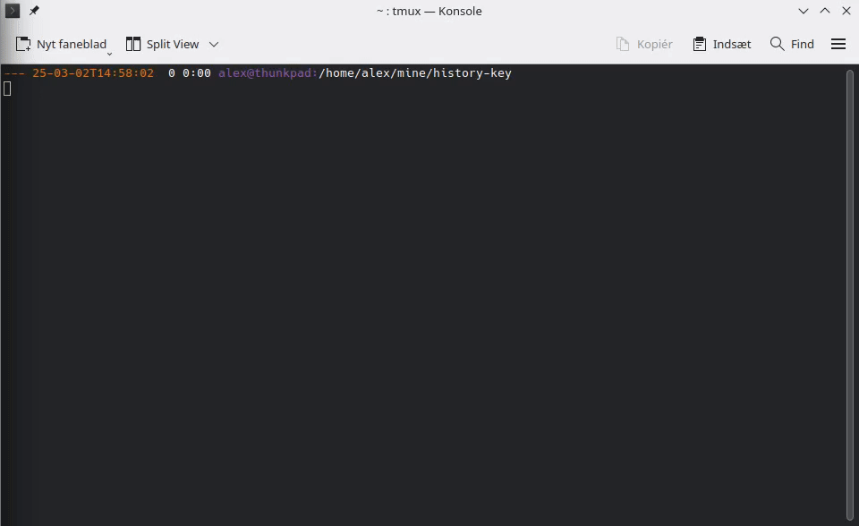

# History key
For the very lazy, select a command in you zsh history by pressing a single key.

# Installation
Clone this repository with `git clone git@github.com:talwrii/history-key.git`

The add the following to your .zshrc

```
source $path_to_checkout/history-key.zsh
```

And create a binding with [bindkey](https://github.com/rothgar/mastering-zsh/blob/master/docs/helpers/bindkey.md).

I use `Alt-Shift-J` which I define `bindkey "^[J" history-key`

# Demo


# Alternatives and prior work
This tool was influened by tools like [avy](https://github.com/abo-abo/avy) in Emacs (inspired by [vim-easymotion](https://github.com/easymotion/vim-easymotion)), [Link Hints](https://addons.mozilla.org/en-GB/firefox/addon/linkhints/) and Vimperator which allow you to jump to text with a single key press.

# About me
I am @readwithai. I make tools related to agency, research and productivity sometimes used [Obsidian](https://readwithai.substack.com/p/what-exactly-is-obsidian).

If you liked this tool you might be interested in:

1. [zshnip](https://github.com/facetframer/zshnip) a define-as-you-go snippet system for zsh. or
2. [orgnav](https://github.com/facetframer/orgnav) a library for navigating org files in emacs
3. [The technical miscellany section of blog](https://readwithai.substack.com/s/technical-miscellany) where I write about my day-to-day technological tricks

Also if you are interested in notetaking you might like to read my [review of note taking in Obsidian](https://readwithai.substack.com/p/note-taking-with-obsidian-much-of)

You can also follow me on [X](https://x.com/readwithai) or my [blog](https://readwithai.substack.com/)
